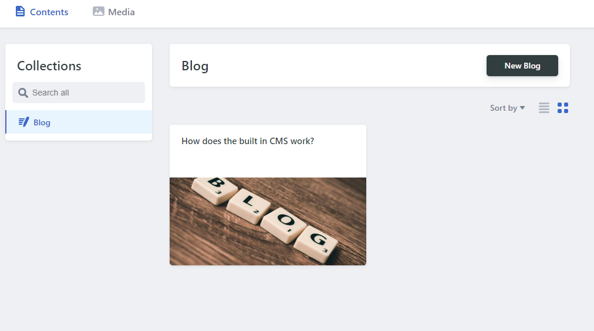
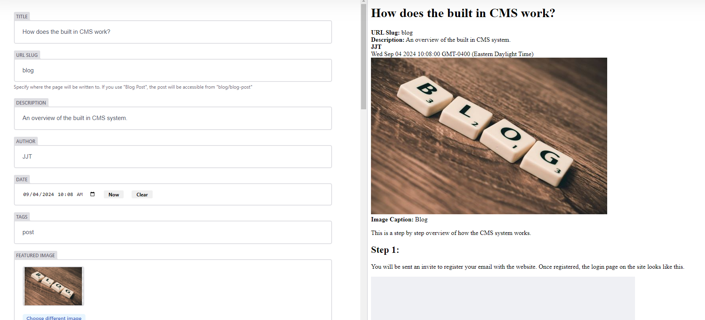

This is a step by step overview of how the CMS system works. 

## Step 1:

You will be sent an invite to register your email with the website. Once registered, the login page on the site looks like this.

## Step 2:

Once you've logged in, the content manager looks like this: 

## Step 3:

Clicking on New Blog opens an editor that looks like this:

From here you can do all of the standard blog formatting, including different header sizes, text styles, as well as inserting images directly into the posts.
